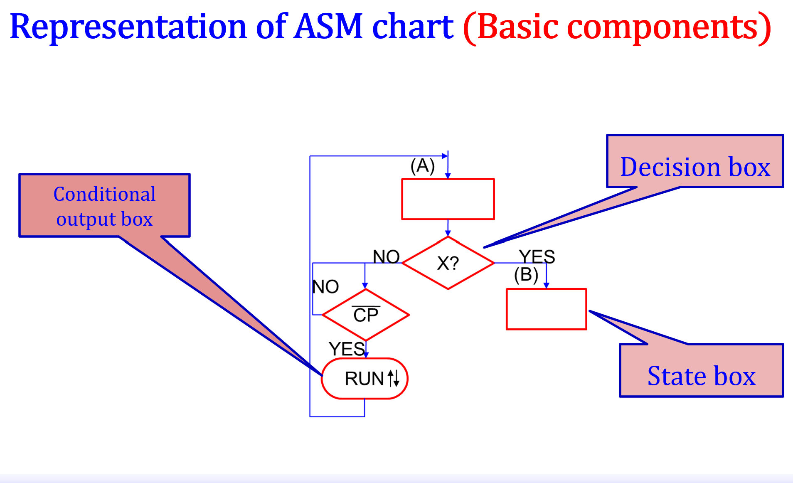
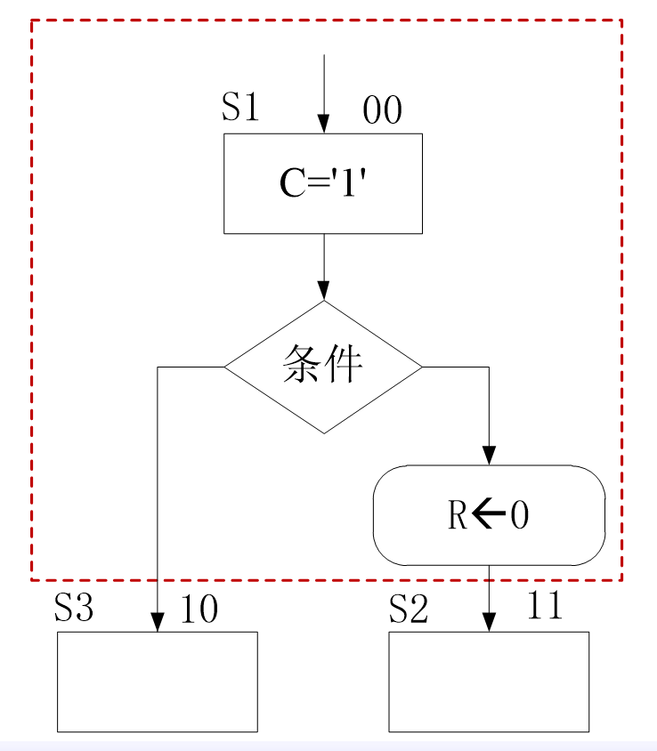

# 第五章 同步时序电路设计

考点：会画ASM图，能画出对应波形图，能写出代码

## 5.1 Sequential Logic Circuit
### **Three significant time parameters** (P87)
- 建立时间$t_{su}$：触发器的时钟信号上升沿到来前数据稳定不变的时间
- 保持时间$t_{hold}$：触发器时钟信号上升沿到来后数据稳定不变的时间
- 传播延时$t_{c-q}$：信号在传播路径上的延时
- 最小传播时间必须满足：
$$T>e_{c-q}+t_{hold}+t_{su}$$

## 5.2 State Machine  
- A mathematic model for computer programs or sequential logic description.
- A sequential logic event can be considered as an abstract machine with a finite number of states. The machine is in one state only at a given time.
- Change from one state to another can be initiated by a triggering event or condition (state transition)s

### 5.2.1 Race and Hazard  
- Race and Hazard: a type of flaw in electronic system. A device may received signals with different delay due to different paths which may causes transient error in output.
- In sequential logic，the next state and output are determined by combinational logic,  where race and hazard may occur. Mistakes may be introduced in the whole sequential system. 
- Race and Hazard can be avoided by synchronous sequential logic. 

### 5.2.2 ASM(Algorithmic State Machine) Chart
- It resembles software flow chart, but it has corresponding hardware structure.

**Components**(P90-91)

#### 5.2.2.1 State box
- 状态名称左上角，编码右上角，框内写操作内容
- 编码方式
  - 二进制编码：需要最少数目寄存器
  - 格雷码：速度较慢，每次只会变一位
  - one-hot编码：较长，需要最多寄存器，逻辑简单，速度快
- 区分操作与输出
  - 操作：例如`R<-0`表示赋值，直到下一次重新赋值才改变`R`的值
  - 输出：例如`C='1'`，表示只在这个状态中才有`c='1'`其他状态`c='0'`
- 一个时钟周期内完成状态

#### 5.2.2.2 Decision Box
- The decision box must **follow and be associated with a state box**. The decision is made in the **same clock cycle** as the actions of the associated state.

#### 5.2.2.3 Conditional Output Box
- **It should follow a decision box**. The output signal is asserted in the same clock cycle as those in the associated decision box.

#### 5.2.2.4 Summary
- **`区分state box`和`conditional output box`**
  - (P91 图5-12) `Decision Box`与其上面的`State Box`在同一时钟周期内完成，若`Decison Box`下接`Conditional Output Box`，则该`Conditional Output Box`与上面的`Decison Box`和`State Box`在同一个时钟周期内完成操作
- 状态机有同步和非同步两种方式，按照常规方式为非同步（输出信号的时序不固定）；若使用临时量存储输出值，最后的输出操作放到seq中，则输出信号按照时钟时序输出，这种方式为同步。

#### 5.2.2.5 **State and State Box**
- One state  is more than a state box.
- Conditional output box, or decision box can also be a part of the state.
- Each state represents a system state during one clock cycle, indicating the operations to be done in the  state.
r4

### **5.2.3 Classification of FSM**
#### In terms of Signal Outputting
- **Mealy**: the output depends on both memory state and the input
- **Moore**: The output depends on memory state only

Differences:  
- Moore machine needs more states than Mealy machine.
- The output of Moore machine is independent of current input, **the effect brought by current input will take palce in the next clock cycle**
- The output of Mealy machine depends on both current state and input. **Input variation leads to immediate output change.** The output can change during the current state. 
- Moore 输出端自动同步，mealy需要人为加入同步信号

判断方法：
1. 看ASM图，每一个状态框中是否要用到输入
2. 看RTL图，看输出是否依赖输入

#### In terms of structure
- One Process: Needs more res **复习2P89**
  - 可能会引入很多额外的寄存器
  - **将state定义为variable**
- Two Process: Needs less res, recommended
  - 最常见的seq和com两个进程，一个用于状态寄存器，一个用于控制次态逻辑和输出
  - **常考**，务必记住格式
  - state应为signal 因为要在进程之间传递
- Three Process
  - 三个进程，一个状态寄存器，一个次态逻辑，一个当前状态输出（把Two Process的com进程进一步拆分，次态逻辑部分和状态内操作分开）

### 状态编码方式（考察编码方式和选择）
在综合的时候对Type枚举类型会进行编码，**编码方式可以人为指定（复习2P109）课本p103格式**

- CPLD更多的提供组合逻辑，而FPGA更多的提供触发器资源，所以CPLD多使用gray-code，而FPGA多使用one-hot编码。
- 对于小型设计使用gray-code和binary编码更有效，而大型状态机使用one-hot编码更有效。

1. 二进制编码
  - 需要寄存器数量最少
  - 需要更多外部辅助逻辑且速度较慢
2. 格雷码
  - 触发器少
  - 速度慢
  - 不会产生两位同时反转的情况避免竞争冒险，异步使用的时候较为有利
3. one-hot编码
  - 寄存器数目最多
  - 逻辑简单速度快
----
