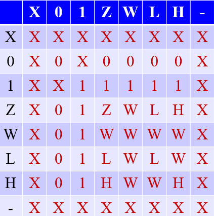
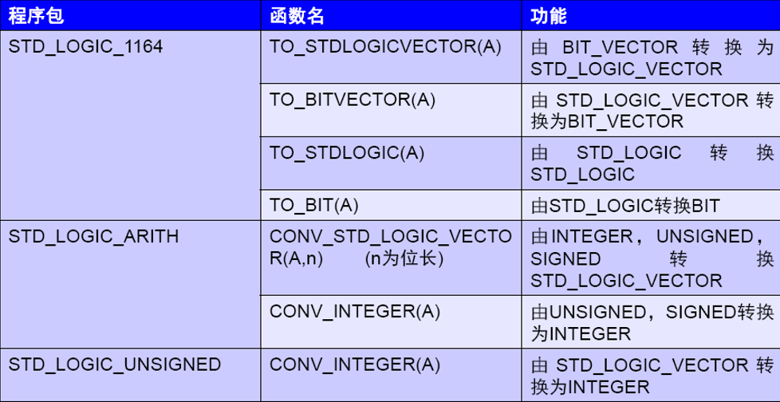

# 第二章 VHDL语言基础

## 2.3 VHDL程序主要构件
- Library 库
- Package 包
- Entity 实体
- Architecture 结构体
- Configuration 配置

### 2.3.1 库
- IEEE库
  - `std_logic_1164`: *functions & data types for multi-level logic*
  - `std_logic_arith`: *defines signed, unsigned types and basic arithmetic operations for representing integers in standard ways*
  - `std_logic_signed`: *signed arithmetic functions*
  - `std_logic_unsigned`: *overloading operators for mixed operation, coversion between different data types*
  
  - for datatype `std_logic` and `std_logic_vector`, **only logical operations can be applied without packages `std_logic_signed` and `std_logic_unsigned`**

- STD库
  - 默认库，定义最基本的数据类型，调用时**不需要显式说明**
- WORK库
  - 存放用户定义的单元和包，调用时**不需要显式说明**

### 2.3.2 实体

```VHDL
ENTITY entitiy_name IS
    GENERIC(const_name:dtype:=value); --[类属参数说明],分号结尾
    PORT(port_name:port_direction dtype); --[端口说明],分号结尾
END [ENTITY] entity_name; --分号结尾
```

- `entity_name` 不能以数字开头
- `[类属参数说明]` 是**常数**，用于说明时间参数、总线宽度等静态信息
- `-[端口说明]` 的`dtype`有四种，分别为：
  - IN
  - OUT
  - INOUT
  - BUFFER: 内部有**反馈** 
- `-[端口说明]`格式如下 
````VHDL
PORT(port1_name:port1_direction dtype; --每个声明之间用分号分隔
    port2_name:port2_direction dtype; --每个声明之间用分号分隔
    port3_name:port3_direction dtype); --最后一个声明不需要分号分隔，但外部括号有分号
````

### 2.3.3 结构体

```VHDL
ARCHITECTURE architecture_name OF entity_name IS
  [DEFINITION]  --定义语句，可定义signal,constant,type,function,component等
BEGIN
  [concurrent statements]
END architecture_name
```

- `architecture_name` 不能以数字开头
- `DEFINITON` **only valid in its defining architecture**
- Each design entity composes only one entity and one architecture. Therefore, it is necessary to specify which of the architectures should be used at any particular time through `configuration declaration`

### 2.3.4 配置
```VHDL
CONFIGURATION configuration_name OF entity_name IS
  FOR architecture_name
  END FOR;
END configuration_name;
```
- `architecture_name` 指多个结构体中要选用的结构体名称


----
## 2.4 VHDL数据对象

### 2.4.1 常量
````VHDL
CONSTANT const_name:dtype:=value --注意要有CONSTANT做引导
````

### 2.4.2 变量
```
VARIABLE variable_name:dtype:=value
```
- Defined in `process` or sub-program (`function`, `procedure`)
- It is **Local** but not Global
- Valid only in the **sequential** areas within a process, sub-program (not within the architecture body)

### 2.4.3 信号

#### 2.4.3.1 信号的定义
   ```VHDL
   SIGNAL signal_name:dtype:=value  --使用:=对信号赋初值
                                          --这个初始值只用于仿真，综合器不支持
   ```
- 信号在声明时用`:= `赋初值
- 信号赋值使用 `<=` 注意此操作有**延时**
  - 对于在进程内的信号赋值操作，每次进程`process`被触发后，虽然进程内有赋值语句，但是**只有当这次进程挂起时信号的赋值语句才会生效**
- **All `PORTS` of an `ENTITY` are signals by default**

#### 2.4.3.2 信号与变量的比较
- `SIGNAL`是global量，可在多个`PROCESS`中传递，但是`VARIABLE`是local量，仅在当前的进程、子程序中有效
- `SIGNAL`除了值以外还存放了历史信息、波形值等，可用于仿真，但是`VARIABLE`不可以仿真
- `PROCESS`只对信号敏感，不对变量敏感

----
## 2.5 VHDL数据类型

### 2.5.1 Standard Datatype

#### Integer
- For representation of bus width, **bit operations/logic operations are not permitted**, needs **range specification**
- 4 byte length

#### Real
- Floating point numbers
- A majority of EDA tools do not support float operations

#### Natural/ Positive
- Subset of integer
- Needs **range specification**

#### Bit
- Single value
- Single quote `''`

#### Bit_vector
- Double quote `""`

#### Character
- ASCII value
- Case sensetive
- Single quote `''`

#### String
- Vector of `Character`
- Double quote `""`

#### Boolean
- Two status, `TRUE` or `FALSE`

#### Time
- For simulation

#### Severity level
- error reminding

### 2.5.2 IEEE Defined Datatype

#### std_logic
- 8-valued logic
- Logic Levels:
  - 'X': unknown, impossible to determine this value
  - 'Z': high impedance
  - '0': logic 0
  - '1': logic 1
  - 'W': weak signal, impossible to tell if it should be 0 or 1
  - 'L': weak signal that should go to 0
  - 'H': weak signal that should go to 1
  - '-': don't care
- **resolved logic system**: if any two std_logic signals are connected to the same node, then conflicting logic levels are automatically resolved according to the rules
- Attention: **case-sensitive** , e.g. High impedance is represented by **‘Z’** rather than ‘z’ .

  

#### std_logic_vector
- no extrapackage required
- only logical operation
- with `IEEE.std_logic_unsigned` or `IEEE.std_logic_signed` included, arithmetic operations are allowed.


#### Std_ulogic
- Unresolved logic system
- Output wires should never be connected together directly
- Logic Levels:
  - 'U': uninitialized
  - 其他8种与`std_logic`相同

#### signed and unsigned
- Package `IEEE.std_logic_arith.all` should be included.
- Arithmetic operations only

### 2.5.3 User-defined datatypes
```VHDL
TYPE Type_name IS Type_def OF basic_dtype;
-- or
TYPE Type_name IS Type_def;
```

#### User-defined datatypes
- Enumeration types
  - used for state machine
  ```VHDL
  TYPE week IS (sun, mon, tue, wed, thu, fri, sat) ;
  ```
- Subtype
  - sub-set of existing types
  ```VHDL
  SUBTYPE natural IS INTEGER RANGE 0 TO INTEGER'HIGH;
  ```

- Integer, Real
  - 若整数和实数的取值范围太大，综合其将无法综合，因此需要限定范围
  ```VHDL
  TYPE percent IS INTEGER RANGE -100 TO 100; 
  ```

- Array
  ```VHDL
  TYPE array_name IS ARRAY(range) OF dtype;
  ```
  例：
  ```VHDL
  TYPE stb IS ARRAY(7 DOWNTO 0) OF std_logic;
  ```

- Records
  - 与array类似，只不过records可以包含不同数据类型的元素
  ```VHDL
  TYPE birthday IS RECORD
    day: INTEGER RANGE 1 TO 31;
    month: month_name;
  END RECORD;
  ```

### 2.5.4 Data Conversion


----
## 2.6 VHDL运算符
### 2.6.1 算术运算符
- `**` 乘方
- `REM` 取余
  - `a REM b`所得结果与`a`符号相同，绝对值小于`b`绝对值
- `MOD` 取模
  - `a MOD b`所得结果与`b`符号相同，绝对值小于`b`绝对值
- `SLA` `SRA` 算术左移 算术右移
  - 左移保持最低位不变，右移保持最高位不变，所有数据（包括最高位）左移或右移
  - 见书本P21图2-6

**综合：加减乘可以综合，除要满足除数为2的n次幂才可以综合（移位），其他运算均不可综合**

### 2.6.2 逻辑运算符
注意P22图2-7的`SLL` `SRL` `ROL` `ROR`

### 2.6.3 关系运算符
- `/=`不等于
- 所有关系运算符的两个操作数必须**类型相同**

----
## 2.7 VHDL基本语句
### 2.7.1 Concurrent Statements
#### 2.7.1.1 When...else Statement
```VHDL
赋值目标 <= 表达式 WHEN 赋值条件 ELSE
           表达式 WHEN 赋值条件 ELSE
           表达式 WHEN 赋值条件 ELSE
           ...
           表达式; --最后才有';'，其他位置没有
```
**优先级从最上面的语句开始向下逐一递减，按顺序判断**

#### 2.7.1.2 With...select Statement
```VHDL
-- 类比switch case语句
WITH 选择表达式 SELECT
赋值目标 <= 表达式 WHEN 条件, --注意用','分隔
           表达式 WHEN 条件,
           表达式 WHEN 条件,
           ...
           表达式 WHEN OTHERS;  --注意最后用';'
                                --最后应当用OTHERS涵盖所有未指定的情况
```
**所有语句同时(simutaneously)判断，不分优先级**

#### 2.7.1.3 Component Instantiation Statement (元件例化语句)
```VHDL
--------- 将设计实体定义为元件，该实体已经预先定义好 ---------
COMPONENT component_name IS
  GENERIC(类属表);  --optional
  PORT(端口名表)    --compulsory, instantiation
END COMPONENT;

------------------------ 调用方式 -------------------------
object_name: component_name GENERIC MAP(...); --写入例化的类属参数
                            PORT MAP(...);  --写入端口映射
```
- **在`ARCHITECTURE`中应放在`BEGIN`语句前**
- 端口映射有两种方式
  - 对照COMPONENT的端口名表，按顺序写入例化的端口
  - 使用 `例化端口名>=端口名表中的端口名` 的格式

#### 2.7.1.4 Generate Statement
##### For Generate
```VHDL
---------For Generate--------
[标号:]FOR 循环变量 IN 取值范围 GENERATE
        说明部分;
       BEGIN
        并行语句;
       END GENERATE[标号];
```
- 生成L个component单元，需要长度为L+1的array of signals作为中继连接，形成component单元"链表"，表头表尾需要分配连接到上述array of signals的头尾

##### If Generate
```VHDL
---------If Generate--------
[标号:]IF 条件 GENERATE
        说明部分;
       BEGIN
        并行语句;
       END GENERATE[标号];
```
- 生成L个component单元，需要长度为L-1的array of signals作为中继连接，形成component单元"链表"，表头表尾不需要分配连接(课本P29例2-13)

#### 2.7.1.5 Process Statement
*`WAIT`语句格式见课本P26例2-10*

- 启动`Process`的两种方式：敏感参数表和`WAIT`语句，两者不能并存
- 敏感参数表和`WAIT`语句的内容必须为`signal`
- WAIT不能被综合器综合，只能用于测试基准


### 2.7.2 Sequential Statements
#### If
- Incomplete `if` statement may introduce register: the sequential logic and combinational logic are mixed in the same process (introduce combinational logic in sequential logic or introduce sequential logic in combinational logic), unwanted register may be introduced. 