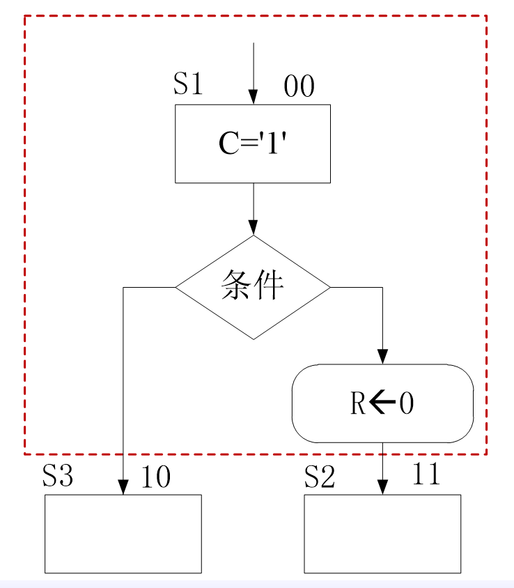

# 第五章 同步时序电路设计

## 5.1 Sequential Logic Circuit
### Three significant time parameters (P87)
- 建立时间：触发器的时钟信号上升沿到来前数据稳定不变的时间
- 保持时间：触发器时钟信号上升沿到来后数据稳定不变的时间
- 传播延时：信号在传播路径上的延时

## 5.2 State Machine  
- A mathematic model for computer programs or sequential logic description.
- A sequential logic event can be considered as an abstract machine with a finite number of states. The machine is in one state only at a given time.
- Change from one state to another can be initiated by a triggering event or condition (state transition)s

### 5.2.1 Race and Hazard  
- Race and Hazard: a type of flaw in electronic system. A device may received signals with different delay due to different paths which may causes transient error in output.
- In sequential logic，the next state and output are determined by combinational logic,  where race and hazard may occur. Mistakes may be introduced in the whole sequential system. 
- Race and Hazard can be avoided by synchronous sequential logic. 

### 5.2.2 ASM(Algorithmic State Machine) Chart
- It resembles software flow chart, but it has corresponding hardware structure.

**Components**(P90-91)

#### 5.2.2.1 State box
- 状态名称左上角，二进制编码右上角，框内写操作内容
- 区分操作与输出
  - 操作：例如`R<-0`表示赋值，直到下一次重新赋值才改变`R`的值
  - 输出：例如`C='1'`，表示只在这个状态中才有`c='1'`其他状态`c='0'`
- 一个时钟周期内完成状态

#### 5.2.2.2 Decision Box
- The decision box must **followed and be associated with a state box**. The decision is made in the **same clock cycle** as the actions of the associated state.

#### 5.2.2.3 Conditional Output Box
- **It should follow a decision box**. The output signal is asserted in the same clock cycle as those in the associated decision box.

#### 5.2.2.4 Summary
- **`区分state box`和`conditional output box`**
  - (P91 图5-12) `Decision Box`与其上面的`State Box`在同一时钟周期内完成，若`Decison Box`下接`Conditional Output Box`，则该`Conditional Output Box`与上面的`Decison Box`和`State Box`在同一个时钟周期内完成操作

#### 5.2.2.5 **State and State Box**
- One state  is more than a state box.
- Conditional output box, or decision box can also be a part of the state.
- Each state represents a system state during one clock cycle, indicating the operations to be done in the  state.
r4

### 5.2.3 Classification of FSM
#### In terms of Signal Outputting
- **Mealy**: the output depends on both memory state and the input
- **Moore**: The output depends on memory state only

Differences:  
- Moore machine needs more stated than Mealy machine.
- The output of Moore machine is independent of current input, **the effect brought by current input will take palce in the next clock cycle**
- The outputt of Mealy machine depends on both current state and input. **Input variation leads to immediate output change.** The output can change during the current state. 